# TP5 – VTAP, Wireshark, HTTPS et Antivirus (Oracle Cloud)

**Cours :** Réseau (420-06C-FX)  
**Enseignant :** Jean-Sébastien Nadeau  
**Session :** Automne 2025

---

## BUT
Le but de ce travail pratique est de mettre en place un serveur web sécurisé sur Oracle Cloud et d’analyser le trafic réseau généré. Pour ce faire, nous avons configuré un serveur HTTP et HTTPS, remplacé Certbot par un certificat SSL auto-signé avec OpenSSL, mis en place un VTAP pour miroiter le trafic et utilisé tcpdump ainsi que Wireshark pour l’analyse. Finalement, un antivirus ClamAV a été installé afin de renforcer la sécurité de l’instance serveur.

---

## 1. Architecture du laboratoire

Le laboratoire est composé de **deux instances Oracle Cloud** :
- Une **instance serveur**, utilisée pour héberger le site web en HTTP (port 80) et HTTPS (port 443)
- Une **instance analyseur**, utilisée pour recevoir le trafic miroir via le VTAP et l’analyser avec Wireshark

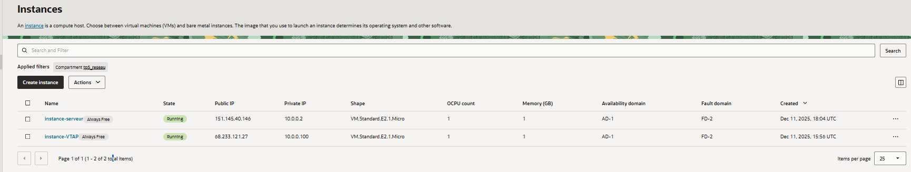

---

## 2. Création du site web

### 2.1 Création du fichier index.html

Nous avons créé le fichier `index.html` directement sur l’instance serveur afin de tester le bon fonctionnement du serveur web.

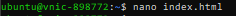
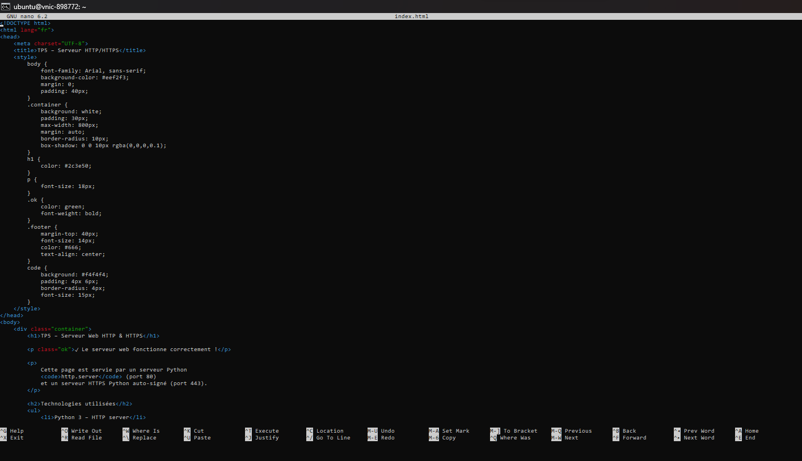

### 2.2 Installation de Python

Avant de lancer le serveur web, nous avons installé Python sur l’instance serveur.

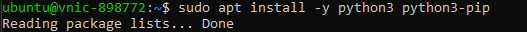
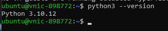

### 2.3 Lancement du serveur HTTP (port 80)

Une fois le fichier HTML prêt, nous avons démarré un serveur HTTP à l’aide de Python.

```bash
sudo python3 -m http.server 80
```

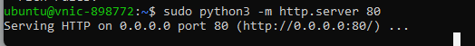
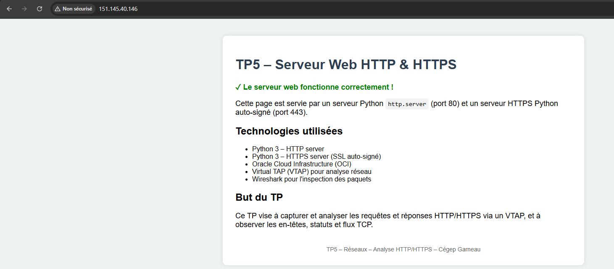

---

## 3. Mise en place du HTTPS avec OpenSSL

Pour la sécurisation HTTPS, **Certbot n’a pas été utilisé**. Nous l’avons remplacé par la création d’un **certificat SSL auto-signé avec OpenSSL**, ce qui est suffisant dans un contexte de laboratoire.

### 3.1 Génération du certificat SSL

Les commandes suivantes ont été utilisées pour générer la clé privée, la requête CSR et le certificat auto-signé :

```bash
sudo openssl genrsa -out server.key 2048
sudo openssl req -new -key server.key -out server.csr
sudo openssl x509 -req -days 365 -in server.csr -signkey server.key -out server.crt
```

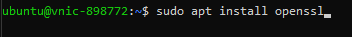
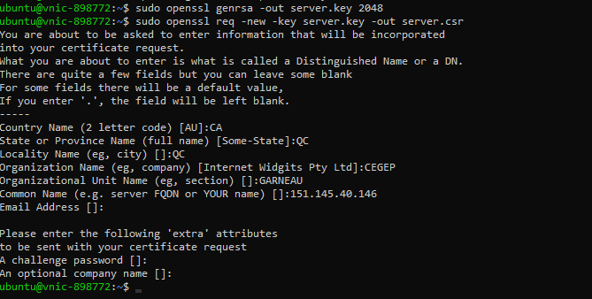
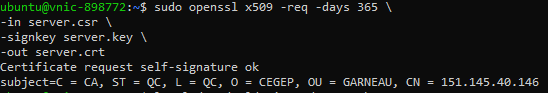
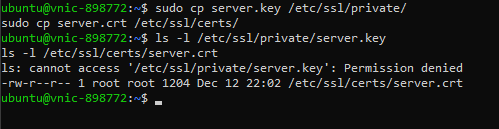

### 3.2 Lancement du serveur HTTPS (port 443)

Après la création du certificat, nous avons lancé un serveur HTTPS sur le port 443.

```bash
sudo python3 https_server.py
```

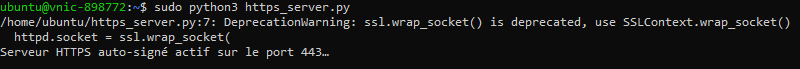
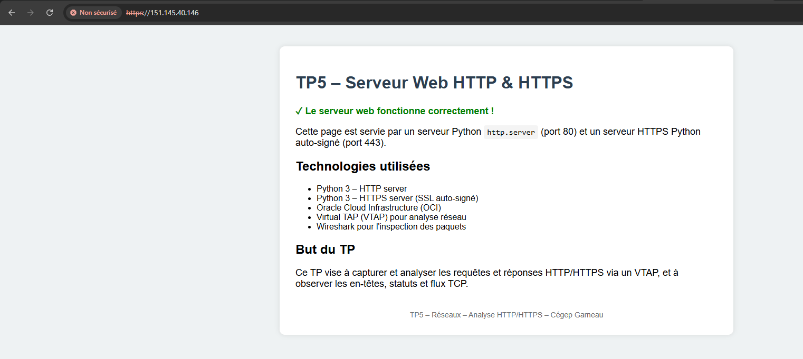

Le navigateur affiche un avertissement de sécurité, ce qui est normal puisqu’il s’agit d’un certificat auto-signé. Le chiffrement TLS est toutefois fonctionnel.

---

## 4. Configuration du Network Load Balancer

Un **Network Load Balancer (NLB)** a été configuré afin de servir de cible au VTAP.

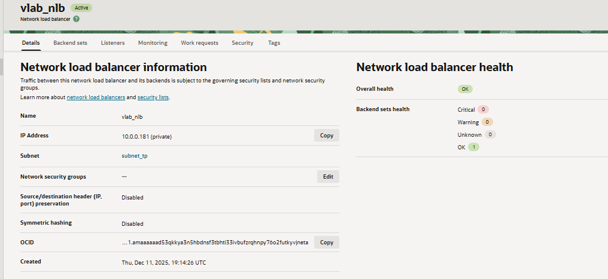

### 4.1 Backend du NLB

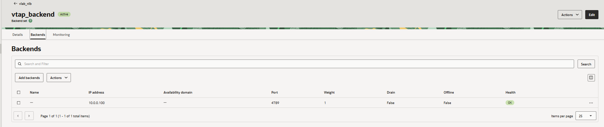

### 4.2 Listener UDP 4789

Le listener UDP 4789 est utilisé pour le trafic VXLAN généré par le VTAP.

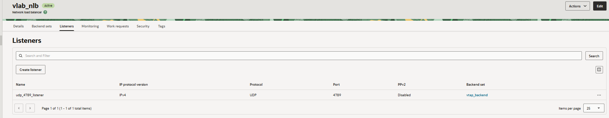

---

## 5. Configuration du VTAP

Le VTAP permet de dupliquer le trafic réseau de l’instance serveur vers l’instance analyseur.


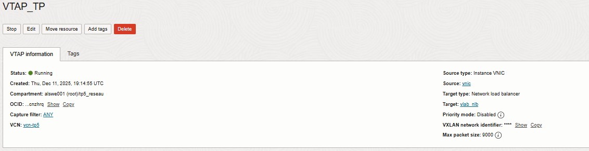

La source du VTAP correspond à l’interface réseau de l’instance serveur, tandis que la cible est le Network Load Balancer.

---

## 6. Capture du trafic réseau

### 6.1 Installation de tcpdump

Pour capturer le trafic directement sur l’instance, nous avons installé tcpdump.

```bash
sudo apt install tcpdump
```


### 6.2 Capture du trafic

```bash
sudo tcpdump -i ens3 -w capture.pcap
```

Le fichier de capture a ensuite été analysé à l’aide de Wireshark sur l’instance analyseur.

```bash
curl http://151.145.40.146
```
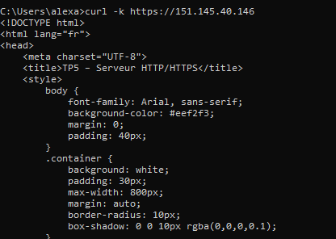

```bash
curl -k https://151.145.40.146
```
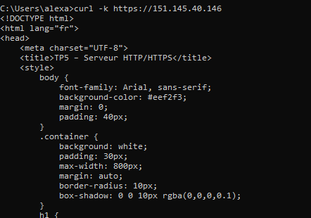

On curl pour faire générer du traffic
---

## 7. Analyse du trafic avec Wireshark

### 7.1 Analyse HTTP / HTTPS

Les captures montrent clairement les échanges HTTP et HTTPS. L’adresse **10.0.0.2 correspond à l’IP privée de l’instance serveur**, dont le trafic est capturé par l’instance analyseur via le VTAP.


### 7.2 Analyse du trafic VTAP (VXLAN)

Un filtre a été appliqué afin d’afficher uniquement le trafic VXLAN :

```
udp.port == 4789
```

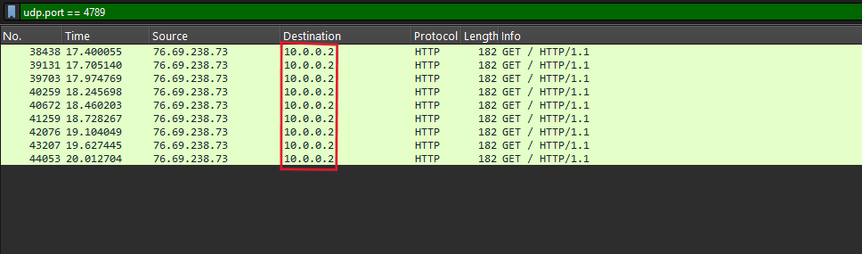

Cela confirme que le trafic est correctement miroité par le VTAP.

---

## 8. Installation et configuration de l’antivirus ClamAV

### 8.1 Installation

```bash
sudo apt install clamav clamav-daemon
```


### 8.2 Activation et mise à jour

```bash
sudo systemctl start clamav-daemon
sudo freshclam
```


---

## 9. Sécurité réseau

Les règles suivantes ont été ajoutées dans les Security Lists d’Oracle Cloud :
- TCP 80 (HTTP)
- TCP 443 (HTTPS)
- UDP 4789 (VTAP / VXLAN)

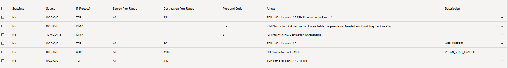

---
