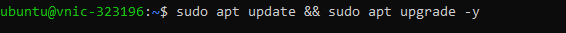
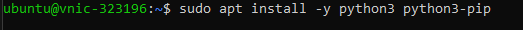
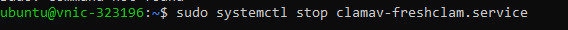
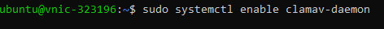
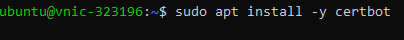

# TP5 – Réseau
**Cours : Réseau**  
**Travail pratique 5 :  Configurer un VTAP, utilisation de Wireshark,
configuration d'un Serveur https et installation d'un antivirus sur Oracle cloud**

**Coéquipiers : Justin Lavigueur et Alexandre Sweeney**

---

## === 1. Configuration du VTAP sur Oracle Cloud ===
Un point d'accès virtuel de test (VTAP) reproduit le trafic d'une source choisie vers une
destination définie afin de faciliter le dépannage, l'analyse de sécurité et la surveillance. Le
VTAP s'appuie sur un filtre d'entrée — un ensemble de règles déterminant quel trafic est
dupliqué.

Étapes pour la création de VTAP sur oracle Cloud  :
### 1.1 — Connexion à Oracle Cloud
- On se connecte à notre compte OCI via le navigateur web.
- Par la suite, on accéde au tableau de bord principal d’`Oracle Cloud`.


### 1.2 — Vérification des Security Lists dans la VCN
On regarde dans la VCN de notre instance la liste de sécurité en défaut pour vérifier les règles de sorties et les règles entrantes:

- On va dans Networking --> Virtual Cloud Networks.
- On ouvre la VCN associée à votre instance.
- On vérifie les Security Lists par défaut pour les **règles entrantes (Ingress)** et **les règles sortantes (Egress)**


### 1.3 — Création d’un Listener pour le Load Balancer
On crée le Listener qui permet au Load Balancer de recevoir le trafic dupliqué:

- On navigue vers Load Balancers.
- On ajoute un Listener.
- On choisit le protocole et le port approprié selon les besoins du test.


### 1.4 — Mise en place du nom du Network Load Balancer
On donne un nom au NLB et choisissons le subnet associé:

- On donne un nom au Network Load Balancer (NLB).
- On associe la VCN et le subnet adéquats.


### 1.5 — Ajout des instances backend
On ajoute les instances Compute nécessaires au backend set:

- On sélectionne les instances compute qui seront dans le backend set.
- On ajoute leur adresse IPv4.
  


### 1.6 — Configuration du Health Check
On configure le protocole, le port et les intervalles de vérification:


### 1.7 — Création du filtre de capture (Capture Filter)

- On va dans VTAP ➜ Capture Filters.
- On crée un nouveau filtre d’entrée.
- On définit les règles qui indiquent quel trafic sera capturé (source, protocole, ports).


### 1.8 — Création du VTAP
On clique sur Create VTAP et on fait les étapes suivantes:
- On sélectionne :
- La source du trafic (instance, ENI, Load Balancer, etc.)
- La destination où envoyer les copies (un outil d’analyse, une autre instance…)
- Le Capture Filter créé précédemment


---

=== 1.9 — (Optionnel) Création d’un serveur HTTP avec Apache ===

Avant d’utiliser Python pour héberger notre serveur HTTP, il est important de mentionner qu’un serveur HTTP classique peut être mis en place avec Apache2, l’un des serveurs web les plus utilisés.

Nous avons installé Apache afin de montrer une alternative professionnelle pour générer du trafic HTTP.

Installation d’Apache2

Apache est un serveur web complet permettant de répondre aux requêtes HTTP.
L'installation se fait simplement avec :

## === 2. Analyse du trafic HTTP avec Wireshark ===
L’objectif de cette section était de générer du trafic HTTP, de le faire passer dans le VTAP et d’observer ce trafic en temps réel dans Wireshark.
Pour ce faire, nous avons hébergé un petit serveur HTTP avec Python et analysé les requêtes capturées.

### 2.1 — Mise à jour de notre instance
Avant d'installer quoi que ce soit, on a mis à jour les paquets du système de l'instance avec les commandes suivantes:

```bash
sudo apt update && sudo apt upgrade -y
```



### 2.2 — Installation de Python3 (nécessaire pour héberger le serveur HTTP)

```bash
sudo apt install -y python3 python3-pip
```



### 2.3 Installation de ClamAV (réalisée pendant la même session)
Cette installation ne fait pas partie directe de Wireshark, mais les commandes sont liées à la mise en place de l’environnement d’analyse.

```bash
sudo apt install -y clamav
```


### 2.4 Arrêt du service FreshClam (pour mise à jour manuelle)
FreshClam est le service qui met automatiquement à jour la base virale. On l’arrête pour pouvoir faire une mise à jour manuelle juste après.
```bash
sudo systemctl stop clamav-freshclam.service
```



### 2.5 Mise à jour de la base virale
On met à jour la base de signatures utilisées par ClamAV pour détecter les virus.
```bash
sudo freshclam
```


### 2.6 Installation du daemon ClamAV
Ce daemon permet d’exécuter ClamAV en arrière-plan et d’effectuer des analyses automatiques.
```bash
sudo apt install -y clamav-daemon --no-install-recommends
```


### 2.7 Activation du daemon ClamAV
On active le service pour qu’il démarre automatiquement au prochain démarrage de l’instance.
```bash
sudo systemctl enable clamav-daemon
```



### 2.8 Démarrage du daemon
On démarre manuellement le daemon afin qu’il soit immédiatement actif.
```bash
sudo systemctl start clamav-daemon
```


### 2.9 Installation de Certbot (même session, utilisé pour HTTPS plus tard)
Certbot sera utilisé plus tard pour générer un certificat HTTPS. On l’installe maintenant car il fait partie de la même session de configuration.
```bash
sudo apt install -y certbot
```



### 2.10 Lancement du serveur HTTP (trafic capturé par le VTAP)
Ce serveur permet de générer du trafic HTTP simple (GET, HTTP/1.0 / 1.1), que le VTAP va dupliquer vers notre instance de capture:

```bash
sudo python3 -m http.server 80
```


