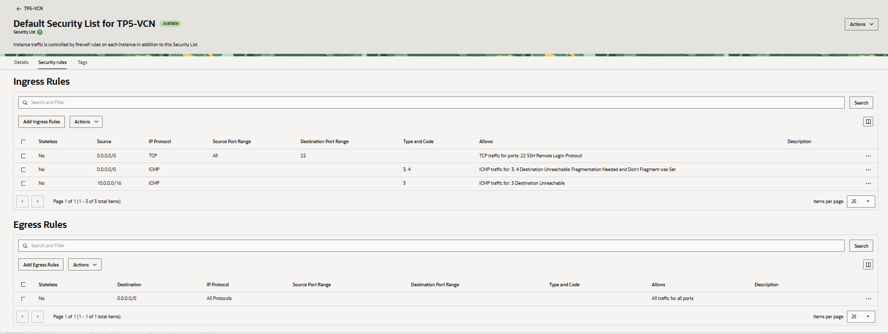
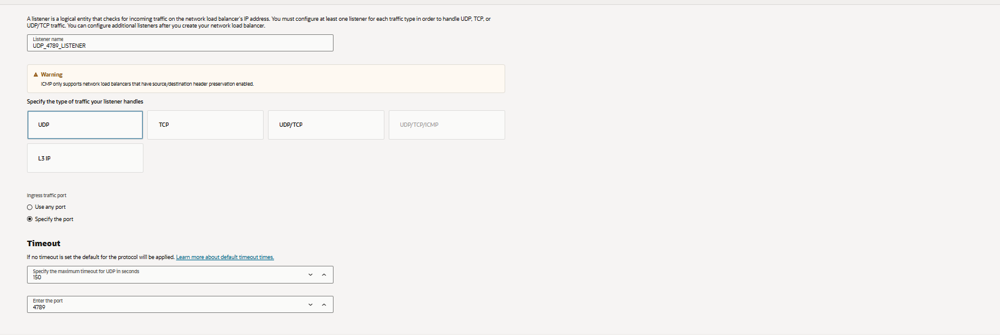
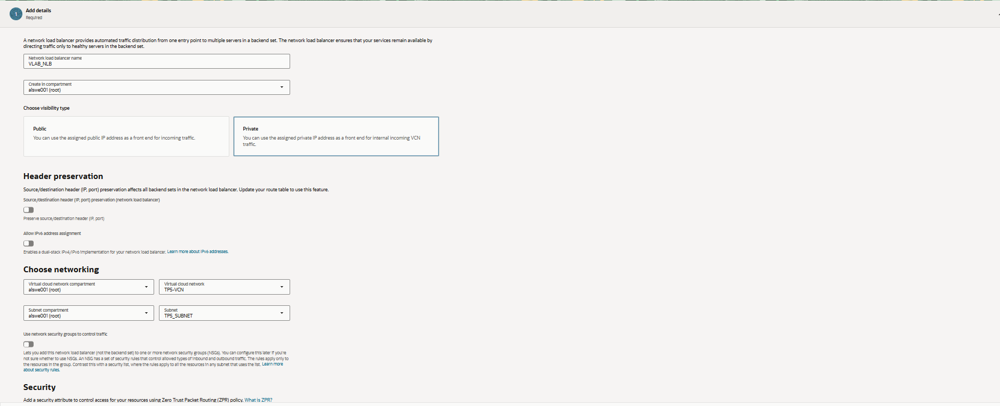
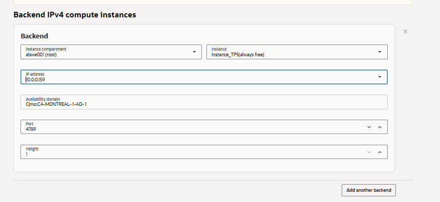
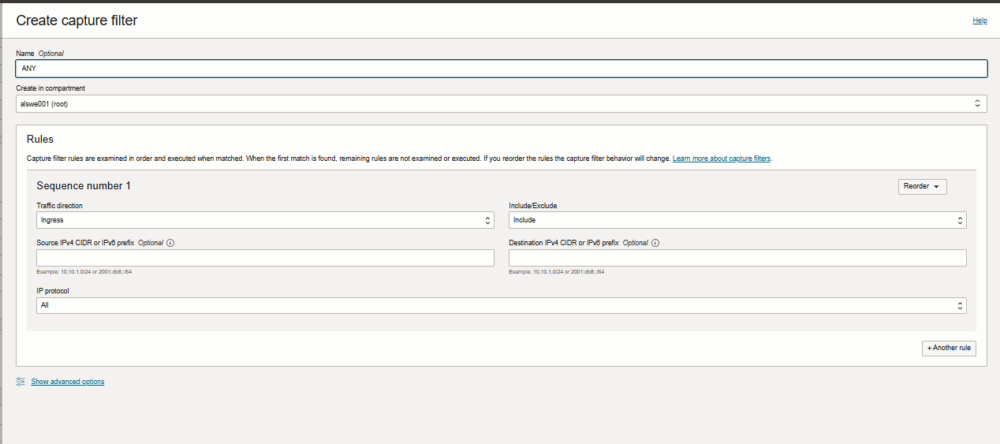
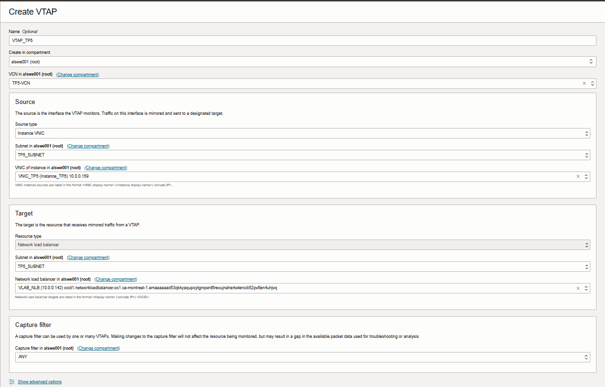

# TP5 – Réseau
**Cours : Réseau**  
**Travail pratique 5 :  Configurer un VTAP, utilisation de Wireshark,
configuration d'un Serveur https et installation d'un antivirus sur Oracle cloud**

**Coéquipiers : Justin Lavigueur et Alexandre Sweeney**

---

# === VTAP ===
Un point d'accès virtuel de test (VTAP) reproduit le trafic d'une source choisie vers une
destination définie afin de faciliter le dépannage, l'analyse de sécurité et la surveillance. Le
VTAP s'appuie sur un filtre d'entrée — un ensemble de règles déterminant quel trafic est
dupliqué.

Étapes pour la création de VTAP sur oracle Cloud  :
1. Connexion à Oracle Cloud:

- On se connecte à notre compte OCI via la console web.
- Par la suite, on accéde au tableau de bord principal d’`Oracle Cloud`.

2. On regarde dans la VCN de notre instance la liste de sécurité en défaut pour vérifier les règles de sorties et les règles entrantes:

- On va dans Networking ➜ Virtual Cloud Networks.
- On ouvre la VCN associée à votre instance.
- On vérifie les Security Lists par défaut pour les **règles entrantes (Ingress)** et **les règles sortantes (Egress)**

3. Création d’un Listener pour le Load Balancer:

- On navigue vers Load Balancers.
- On ajoute un Listener.
- On choisit le protocole et le port approprié selon les besoins du test.

4. Mise en place du nom du Network Load Balancer:

- On donne un nom au Network Load Balancer (NLB).
- On associe la VCN et le subnet adéquats.

5. Ajout des instances backend

- On sélectionne les instances compute qui seront dans le backend set.
- On ajoute leur adresse IPv4.
  

6. Configuration de la politique de Health Check

- On définit une politique de Health Check avec son protocole, son port et l'intervalle de vérification :

7. Création du filtre de capture (Capture Filter)

- On va dans VTAP ➜ Capture Filters.
- On crée un nouveau filtre d’entrée.
- On définit les règles qui indiquent quel trafic sera capturé (source, protocole, ports).

8. Création du VTAP

- On clique sur Create VTAP.
- On sélectionne :
- La source du trafic (instance, ENI, Load Balancer, etc.)
- La destination où envoyer les copies (un outil d’analyse, une autre instance…)
- Le Capture Filter créé précédemment

