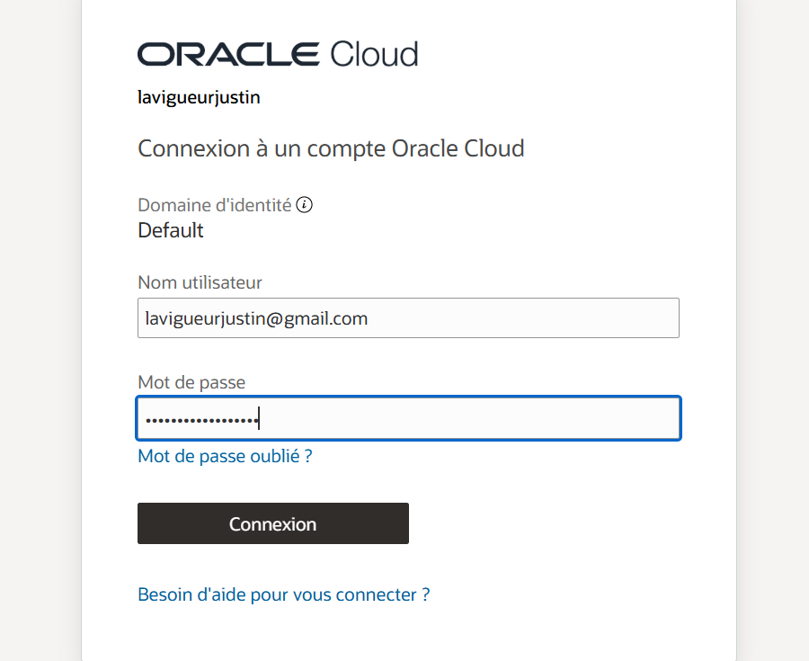
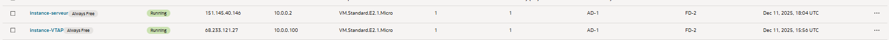
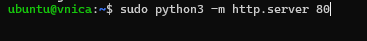
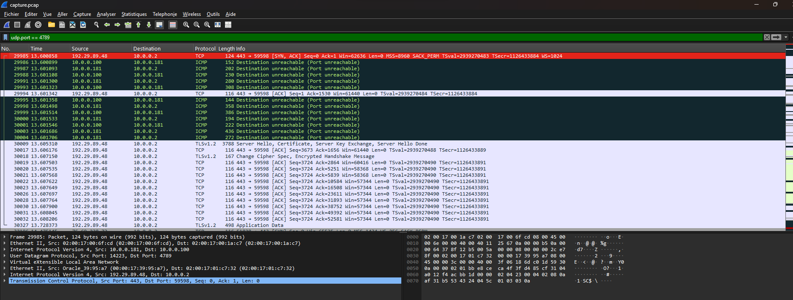
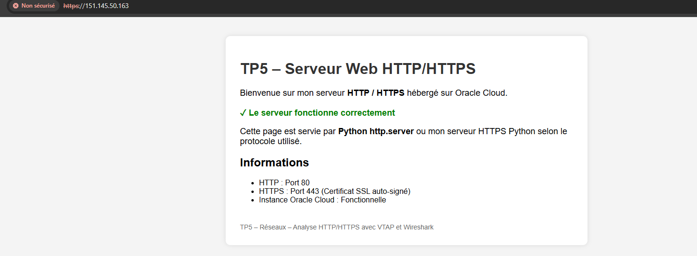
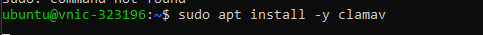
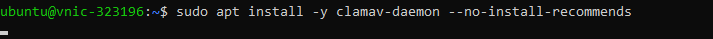

# TP5 – VTAP, Wireshark, HTTPS et Antivirus (Oracle Cloud)

**Cours :** 420‑06C‑FX – Réseaux
**Enseignant :** Jean‑Sébastien Nadeau  
**Session :** Automne 2025

**Équipe :**  
- Nom étudiant 1  
- Nom étudiant 2


---

## Architecture générale
- 2 instance **Oracle Cloud Compute (Ubuntu)**
- 1 **VTAP** attaché à l’instance analyseur
- 1 serveur web Python (HTTP & HTTPS) attaché à l'instance serveur
- 1 antivirus **ClamAV**





---

## Configuration du serveur HTTP

### Démarrage du serveur HTTP
```bash
sudo python3 -m http.server 80
```

### Vérification dans le navigateur
- Accès via l’IP publique de l’instance
- Affichage du fichier `index.html`



---

## Création et configuration du VTAP

### Étapes réalisées dans OCI
1. Création du **VTAP**
2. Sélection de l’instance comme **source**
3. Définition du **VTAP target**
4. Configuration des **filtres (HTTP / TCP)**


---

## Capture et analyse avec Wireshark

### Filtres utilisés
- Filtre d’affichage :
```
http || tcp.port == 80
```

### Analyse effectuée
- Requêtes HTTP GET
- Réponses HTTP (codes 200, 304, etc.)
- En‑têtes HTTP
- Cookies
- Suivi de flux TCP




---

## Hébergement du site HTTPS (SSL/TLS)

### Installation de CertBot
```bash
sudo apt update
sudo apt install certbot -y
```

### Génération du certificat
```bash
sudo certbot certonly --standalone -d votre-domaine-ou-ip
```

### Configuration du serveur HTTPS Python
- Utilisation du certificat généré par **Let's Encrypt**
- Exécution en mode `sudo`




---

## Installation et configuration de ClamAV

### Installation
```bash
sudo apt install clamav clamav-daemon -y
```

### Mise à jour des signatures
```bash
sudo freshclam
```

### Test de scan
```bash
clamscan test.txt
```





---

## Sécurité et bonnes pratiques
- Pas d’utilisation de **ufw** (recommandation OCI)
- Accès SSH sécurisé par clé
- HTTPS avec certificat valide
- Analyse antivirus régulière

---

## Contenu du dépôt Git
- `README.md`
- Dossier `imagesTP5/`
- Captures d’écran de toutes les étapes

---


